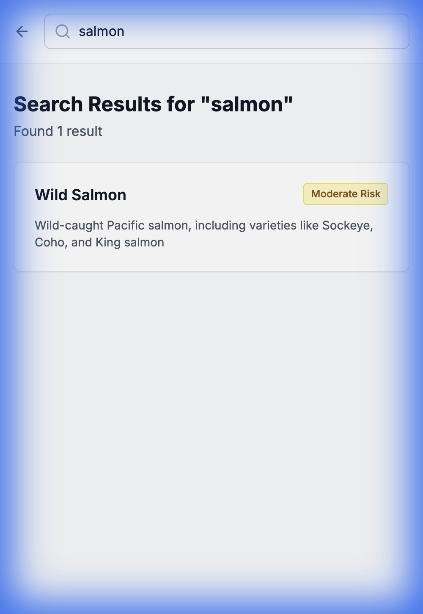
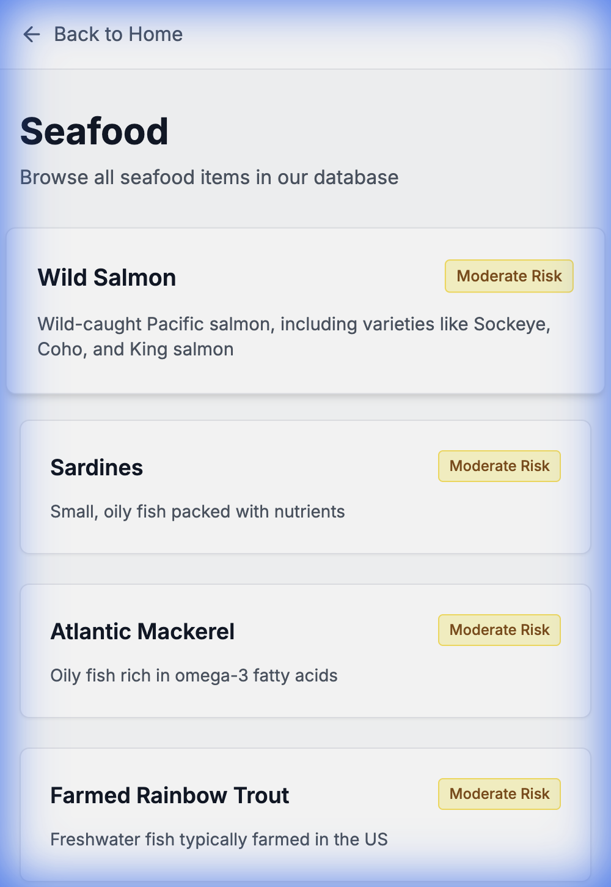

# Food Safety Platform Demo

This document showcases the fully functional Food Safety Platform, demonstrating search, navigation, and detailed data views.

## 1. Homepage
The homepage features a search bar, popular searches, and category navigation.

## 2. Search Results
Searching for "Salmon" returns relevant results with risk indicators.

## 3. Food Detail (Wild Salmon)
The detail page provides comprehensive data including contaminants (Mercury, PCBs) and nutrients (Omega-3, Protein).
*Note: This view was successfully enabled by fixing backend serialization issues.*

## 4. Category View (Seafood)
Browsing the "Seafood" category shows a grid of available items with their risk levels.

