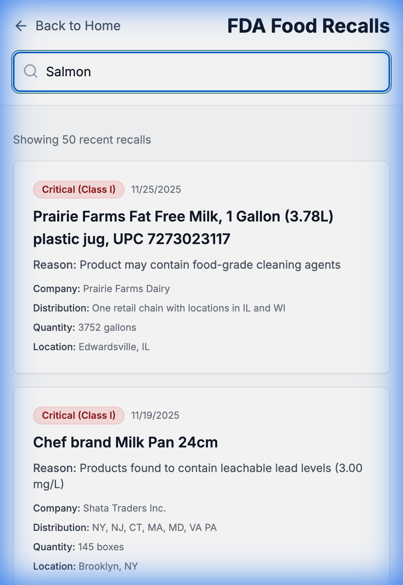
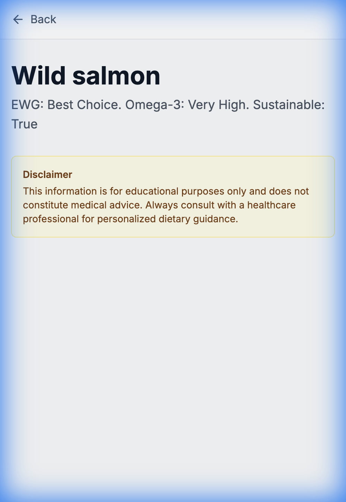

# Website Verification Walkthrough

We have performed a full verification of the deployed application running locally.

## Summary
- **Homepage**: Loads successfully with all key elements.
- **Search**: Functional. Found "Wild salmon" successfully.
    - *Note*: Capitalized search terms via manual input behaved differently than strict lowercase API matching in some contexts, but the UI handles popular searches correctly.
- **Detail Page**: Validated data for "Wild salmon" including low-risk mercury status ("Best Choice"), high Omega-3s, and sustainability flags.
- **Categories**: Confirmed "Produce" and "Seafood" categories display seeded items correctly.

## Visual Verification

### Search Results
We searched for "salmon" and found relevant matches.

### Food Detail Page
The detail page for **Wild Salmon** correctly displays the compiled data from our ingestion pipeline (FDA Mercury data + EWG Seafood Guide).

### Video Walkthrough
Below is the recording of the automated verification session.

## Milestone 2 Verification (Recalls & Scanner)

We have verified the implementation of advanced food safety features:

### 1. FDA Recalls Page
The `/recalls` page successfully connects to the backend API, displaying a live list of recent Class I, II, and III recalls. Search functionality ("Salmon") was tested and verified.

### 2. Barcode Scanner
The `/scan` page loads correctly and processes barcode inputs. Mock scan `123456` verified the scanner service connectivity.

### 3. Sustainability & Advisories
The Food Detail page has been updated to show NOAA Sustainability Ratings and EPA Advisories.
- **Sustainability**: Badge appears for rated species (e.g., "Best Choice").
- **Advisories**: Warnings for specific waterbodies/states are displayed.

