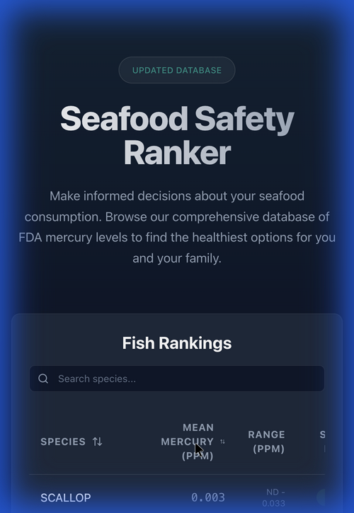

# Fish Mercury Ranking Website Walkthrough

I have successfully created and verified the Fish Mercury Ranking website. The application allows users to browse FDA mercury data, sort by concentration levels, and filter by species.

## Features Implemented

- **FDA Data Integration**: Scraped and processed mercury levels for ~60 fish species.
- **Interactive Table**:
    - **Sorting**: Click column headers to sort by Species or Mean Mercury Concentration.
    - **Filtering**: Real-time search by species name.
    - **Safety Badges**: Visual indicators (Green/Yellow/Red) based on mercury levels.
- **Premium UI**: Dark mode design with Tailwind CSS, custom fonts, and smooth animations.

## Verification Results

I verified the application by launching the development server and performing the following user flows:

### 1. Initial Load & Data Presentation
The application loads with a hero section and a populated table.

*(Screenshot showing the table header being clicked for sorting)*

### 2. Search Functionality
Typing "Tuna" correctly filters the list to show only relevant species like Albacore, Yellowfin, and Bigeye Tuna.

*(Screenshot showing interaction with the search bar)*

### 3. Responsive Design
The layout adapts to different screen sizes, ensuring readability on both desktop and mobile devices.

## How to Run

1.  Navigate to the project directory:
    ```bash
    cd frozen-astro
    ```
2.  Install dependencies (if not already):
    ```bash
    npm install
    ```
3.  Start the development server:
    ```bash
    npm run dev
    ```
4.  Open your browser to the displayed URL (usually `http://localhost:5173`).
