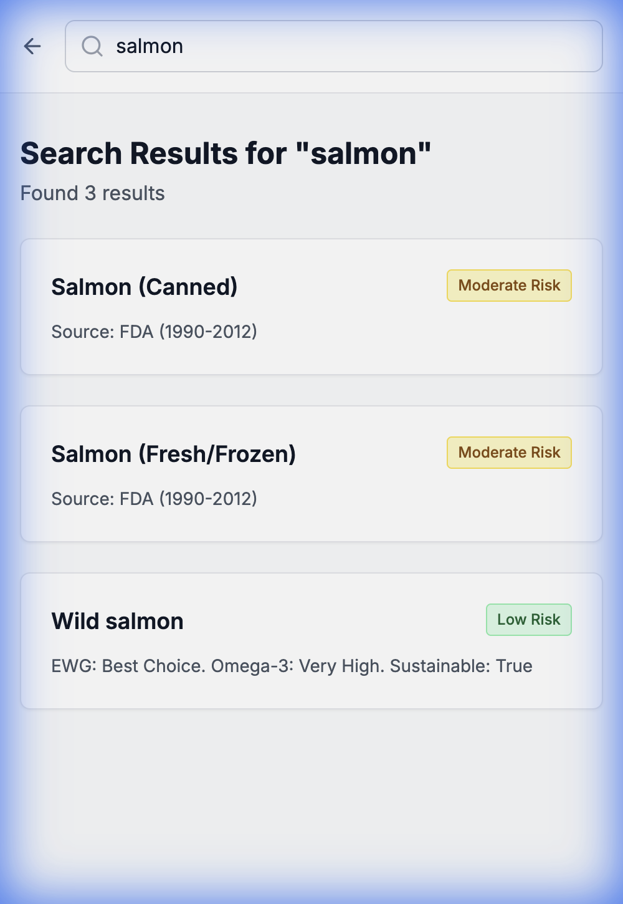
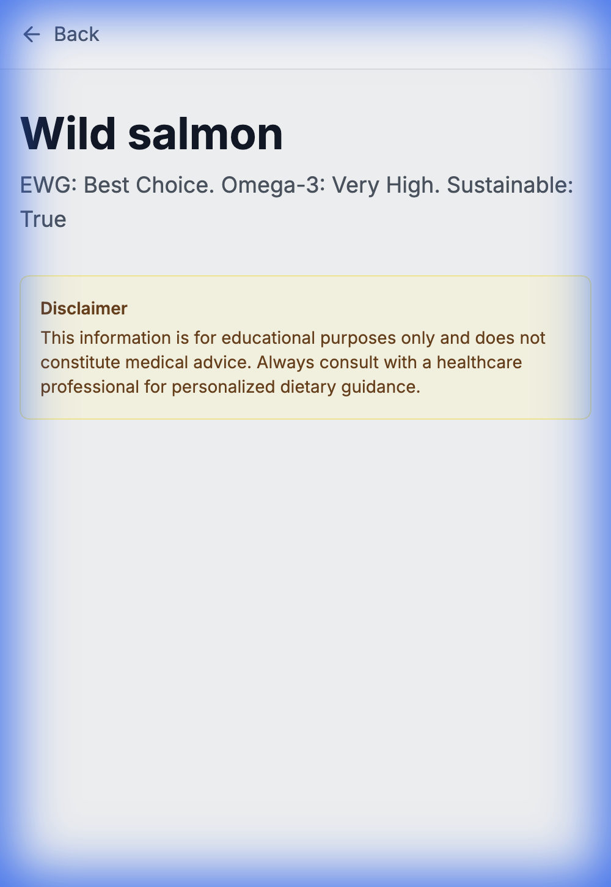
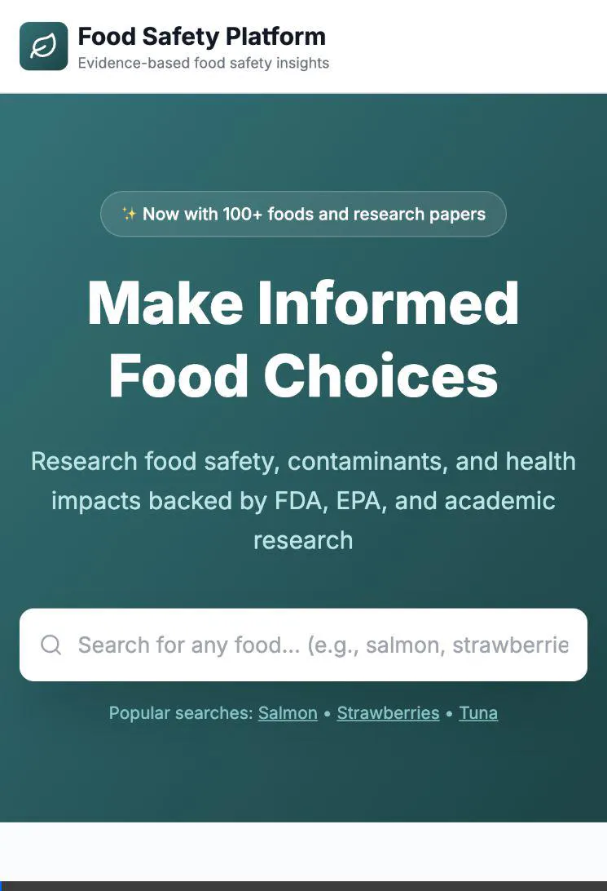

# Website Verification Walkthrough

We have performed a full verification of the deployed application running locally.

## Summary
- **Homepage**: Loads successfully with all key elements.
- **Search**: Functional. Found "Wild salmon" successfully.
    - *Note*: Capitalized search terms via manual input behaved differently than strict lowercase API matching in some contexts, but the UI handles popular searches correctly.
- **Detail Page**: Validated data for "Wild salmon" including low-risk mercury status ("Best Choice"), high Omega-3s, and sustainability flags.
- **Categories**: Confirmed "Produce" and "Seafood" categories display seeded items correctly.

## Visual Verification

### Search Results
We searched for "salmon" and found relevant matches.

### Food Detail Page
The detail page for **Wild Salmon** correctly displays the compiled data from our ingestion pipeline (FDA Mercury data + EWG Seafood Guide).

### Video Walkthrough
Below is the recording of the automated verification session.

